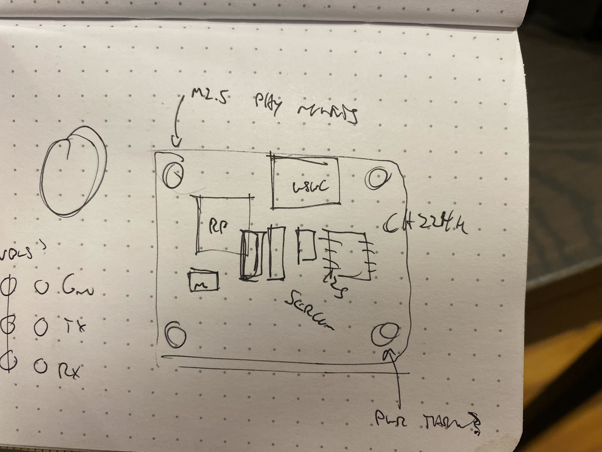

## 2022 12 12 

Just collecting notes / thoughts on this design here today... 

- rp2040, ch224k pd, usb-c 
- should be in pinout-alignment with https://www.adafruit.com/product/4900, plus more (along the bottom?) and VBUS, etc... 
- consider using a 10-pin JTAG type connect for the thru-lift to the modular PHY ? 
- power... shoud be easy: i.e. diode (or FET) to switch VBUS on / off, so that USB-and-high-power can be easily simultaneously connected 
- i2c breakout a-la qwiik for future embedded i2c-bus hijacking 
- 2x4 (?) SERCOM-type breakout for future proper-bus integrations 
  - needs to consider power integration as well ? 
- should break out USB lines on smt pins below, for connection to i.e. a pogo-pin'd end-effector circuit 
- rp2040: what's a minimum schematic, what flash chip, is it available, and usb-pd lines ? 
  - uses https://lcsc.com/product-detail/NOR-FLASH_Winbond-Elec-W25Q16JVUXIQ_C2843335.html 
  - has a gd built-in bootloader 
  - does one exist ? 
  - rgbled and one button per ? 
  - break out the same pins as the pico, 0.05" castellated 
  - try to do it with JLCPCB bits 
  - how do we bootload it?
  - circuit should have 5v-auto-select, so we can plug in USB and other power, this is ~ just a diode from vbus to others, non ? 
  - https://oshwlab.com/wagiminator/ch224k-usb-pd-decoy 
    - https://www.lcsc.com/product-detail/USB-ICs_WCH-Jiangsu-Qin-Heng-CH224K_C970725.html 
  - can we get ahn flush-mount usb-c 
- rp2040 is looking hella-tite... allegedly fast FPU maths w/o FPU: https://www.reddit.com/r/embedded/comments/l2l4zn/why_would_raspberry_pi_release_this_seemingly/ https://github.com/Wren6991/picodvi ... manchester ?? https://github.com/raspberrypi/pico-examples/tree/master/pio/differential_manchester 
  - paired w/ USB-C PD and good USBRoadcast, it is the PHY killer, the hot shit, the good good stuff, and we shoooould get after that 
  - pls also a cute RGB led and a user button on each ? unless cost is big 
- rp2040 
  - notes go to modular-things/circuits log or sth, 
  - flush-mount usb possible ? 
  - include that sketch w/ m2.5 mounts, 2x4 PHY interconnect, ... I2C QWIIK (it's in 2022-12/)

## 2022 12 14 

### Circuit Ecosystem Solutions

- firstly, we should recall that it is possible to build any project as a modular-thing... whammo, that should be up-front and demonstrated,
  - it might want a typed (and discoverable) osap-api, for auto-thingification
- we can use seeed xiao boards, which are pin-compatible with i.e. https://www.adafruit.com/product/4900 - as a baseline for modular-things, esp. things that don't need big power, so i.e. one-off sensors, etc, are just like daughters (of some common size) for these ^^ ecosystems, 
- then for power (and big networking, when it comes) we build the mod-jewel, which has USB-PD, the bus-attachable, etc: it's the big lifter, etc, and we can later do SAMD51s, STMs, etc, if we see fit, to swap onto hardware. it's the (surprise) hardware abstraction layer we didn't know we needed... 

### Also

- we can half-flip the modules, so that they are effectively dual-sided (components-wise) pcbs: then i.e most things remain at the xiao size, nice 
- and, try out the SPI-PHY bus update: rolling-turn-taking, cs-pin to packet delineate, nice 