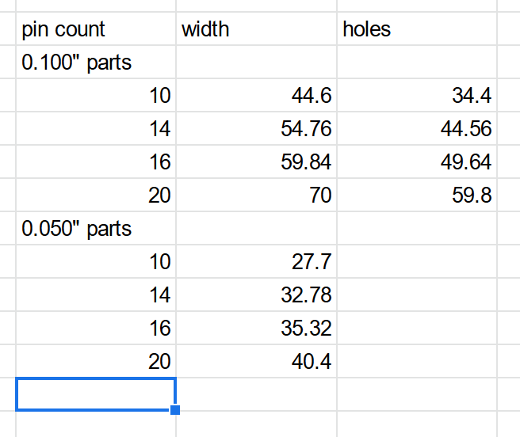
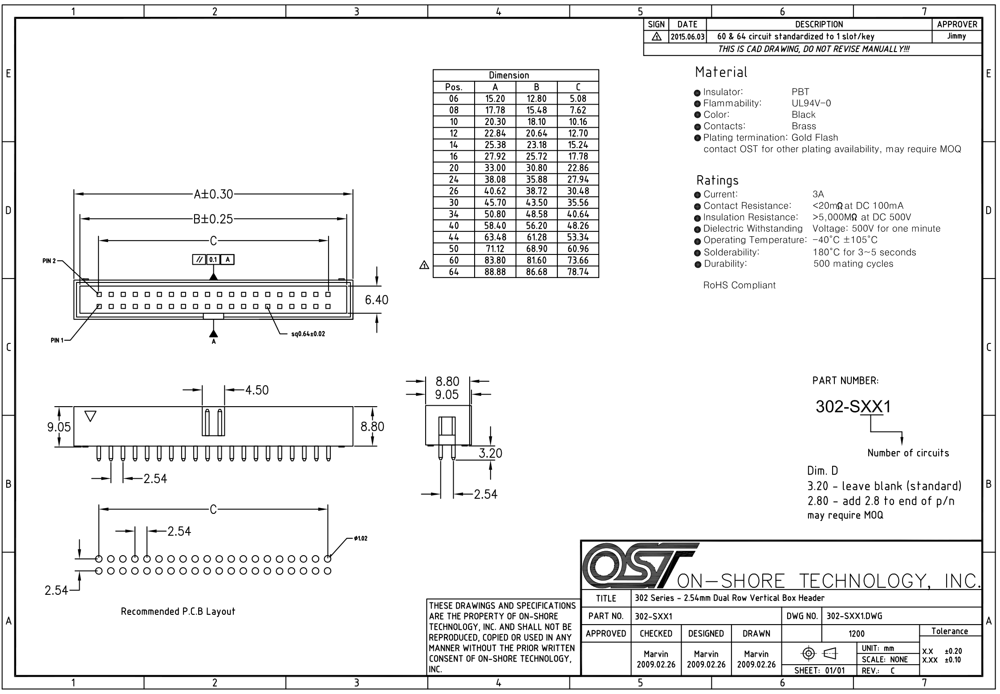

## 2022 12 31 

I'm drawing up plans for this new bus... situation. So far I'm scheming on SPI-operated / CS-delineated, clocked, shared medium: i.e. CS, CLK, and DATA (MOSI / MISO on the same net), then a kind of round robin transmit w/ selectable or adhoc bus id's... where everyone tx's something each round, token-d' etc - some kind of UCBus / variable rate mutt. Small code, no COBs.

ETC. I want to find parts today: a 6-pin latching 0.100" header-type thing, to do:

| 1 | 2 | 3 | 4 | 5 | 6 |
| --- | --- | --- | --- | --- | --- |
| 24v | 5v | GND | CS | CLK | DATA | 

That line ... does it: we have a simple bus which we can ~ CRC to eliminate the `will-for-sure-happen` bit errors (or maybe we do error-correcting codes, since ~ likely only one or two will be rm'd at a time?)... It'll do power / data from device to device, w/ 75W power per (if we assume 3A per pin & the 24v), so can service ~ battery powered robots, small shit, etc, and is basically breadboard compatible. Needs a part

### 6-Pin TTL Connector Candidates

- RJ12 ?
- something like... A31084-ND ? IDC 
- OK... find... the connectors from the osap-mule project, those could be it
  - or those latchers from molex, that are ~ assembled w/ crimped ends,
- honesly, 2x3 IDC, the cable-and-end availabilities are *so* much better. 
- it's less breadboard friendly, but only kind of ? Can't imagine running workshops w/ the results of this query: https://www.digikey.com/en/products/filter/rectangular-cable-assemblies/450?s=N4IgjCBcoBw1oDGUBmBDANgZwKYBoQB7KAbRACYAWATgHYBmABhAF0CAHAFyhAGVOATgEsAdgHMQAXwJhZ1BCGSR02fEVIg65AGysO3SH0GiJ08NRjzoi1JlwFikMsxZmAtOQVLBAVzWOyAFZWSVCgA
- though we have some of these already: 900-2162701063-ND 

### The RS-485 Shift 

Then we want the elevated PHY - where we bump everything up to RS485 and crank the power a little, for big machines... here I'm undecided exactly, but it's more or less a-la:

| 1 | 3 | 5 | 7 | 9 | 11 |
| --- | --- | --- | --- | --- | --- |
| 24v | 5v | GND | CS:A | CLK:A | DATA:A | 
| 24v | 5v | GND | CS:B | CLK:B | DATA:B |
| **2** | **4** | **6** | **8** | **10** | **12** |

Or ~ something along these lines. First question is w/r/t IDC connectors: we can have 0.050" or 0.100" style, both available in latching versions: the larger typically more-available, and cheaper, and higher current, but... ofc also larger. What are candiadates?

### 0.100" Candidates 

- AHB14H-ND 
- ED10522-ND 14-pin, non-lathching (do fdm latch d-sign)

This is basically an availability check... I'm seeing 10, 14, 16, 20 pin versions are common, but not the 12 I had originally designed for. Also am seeing only 1.75 ~ 1 amp / contact, not the 3 (?) I had seen elsewhere. Though some are rated to 3A, so it's per-part. 

w/ ejectors, typically `2.54 * pin-count + 19.2` width  
and `2.54 * pin-count + 9` hole spacing... 

### 0.050" Candidates

- 952-2678-ND 

There are some of these that rate up to 3.75A / contact (!) but they're the big $$, like `$9` per part. 

w/ ejectors, typically `1.27 * pin-count + 15.0`

### Connector Size

So, bummer:

The 0.100" are beefy - I wanted to see ~ like a 16 pin 0.100" part for the oodles of current, but want also the little moduuules to be ~ 40mm to a side, or 30 if we can get 'em. 30mm hole spacing more likely... meaning the 16 pin `0.050"` bits are likely the move. 

I *kind* of like this, but also... am not into it: the `0.050"` parts are towards "more idiosyncratic" - everyone knows (and loves) a `0.100"` header. It's the latches that bung us up on the width.

So I think the move, perhaps, is to engineer our own little FDM-printed latching thing, which we can then option-on to assemblies, or not. It's cheap, guaranteed to be ubiquitous (the connectors, I mean) - etc. We stay adaptable. Slick AF. 

So, what are those widths like?

So we get a 14-pin for 25.38mm, 16 for 27.92... meaning I can fit a 30mm-across hole gap across the ends of the 14 pin. Given 3A per contact, we can run:

| 1 | 3 | 5 | 7 | 9 | 11 | 13 |
| --- | --- | --- | --- | --- | --- | --- |
| 24v | 24v | GND | GND | CS:A | CLK:A | DATA:A | 
| 24v | 5v | GND | GND | CS:B | CLK:B | DATA:B |
| **2** | **4** | **6** | **8** | **10** | **12** | **14** |

For ~ 3*3 = 9 * 24v ~ 216W into one drop, pretty gud. 16 would be cooler:

| 1 | 3 | 5 | 7 | 9 | 11 | 13 | 15 |
| --- | --- | --- | --- | --- | --- | --- | --- |
| 24v | 24v | 5v | GND | GND | CS:A | CLK:A | DATA:A | 
| 24v | 24v | GND | GND | GND | CS:B | CLK:B | DATA:B |
| **2** | **4** | **6** | **8** | **10** | **12** | **14** | **16** |

For ~ 4*3 = 12 * 24 = 288W into one drop. In any case the 200 is surely enough, and the fit should be slick, that's important. If we end up with KW-scale stuff... we can work something else out then; go wider, etc. Cross bridges when we get there. 

### RS485 IC Candidates 

- see previous work on SPI-PHY, right ? in stock ? 
- https://www.digikey.com/en/products/detail/texas-instruments/THVD1550DR/7702384 
- https://www.digikey.com/en/products/detail/renesas-electronics-america-inc/ISL3179EIRZ/1879479 
- need to figure out how to use cs-pin for enable situations, right ? 

## Footprints / Modularity... 

--- 

## Current Pinouts and Connectors 

- use a 6-pin (TBD) latching `0.100"` conn, breadboard compat, for TTL siggos
  - probably select 2x3 ICD, don't git complex, these cables / etc are ubiquitous, great, etc... 
  - needs to consider reverse polarity, perhaps ? 
- use a 2x7-pin shrouded THT part, non-latching, for the RS485 pinout:

| 1 | 3 | 5 | 7 | 9 | 11 | 13 |
| --- | --- | --- | --- | --- | --- | --- |
| 24v | 24v | GND | GND | CS:A | CLK:A | DATA:A | 
| 24v | 5v | GND | GND | CS:B | CLK:B | DATA:B |
| **2** | **4** | **6** | **8** | **10** | **12** | **14** |

And engineer the FDM thing-to-bus-phy connector device, to keep things 2gether. 

## Error Catching or Error Correcting (or: both?)

This is a question... like, what kind of errors do we observe, for one, and then... CRC, or something fancier, correcting codes as well, or some combo of both. There's trade offs in processing requirements, overhead, etc. 

## Wrapup 

It'd be rad if this could function as a standalone arduino library, that i.e. OSAP uses as a dependency... and it should get a slick name, non? 