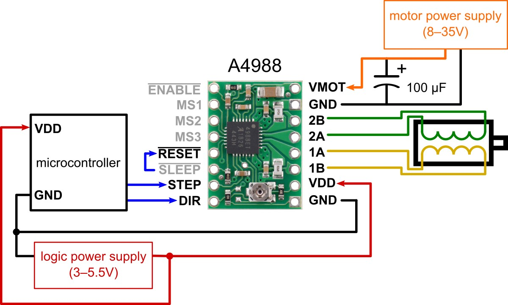
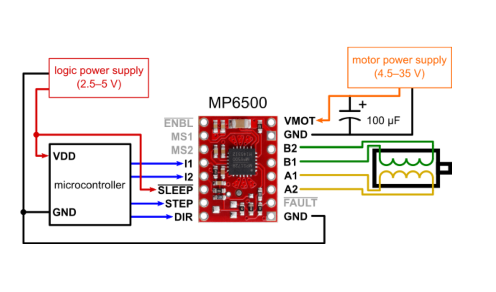
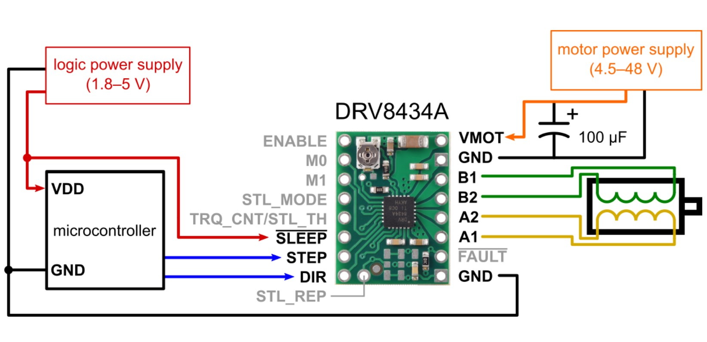
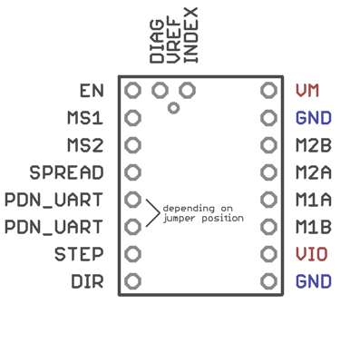
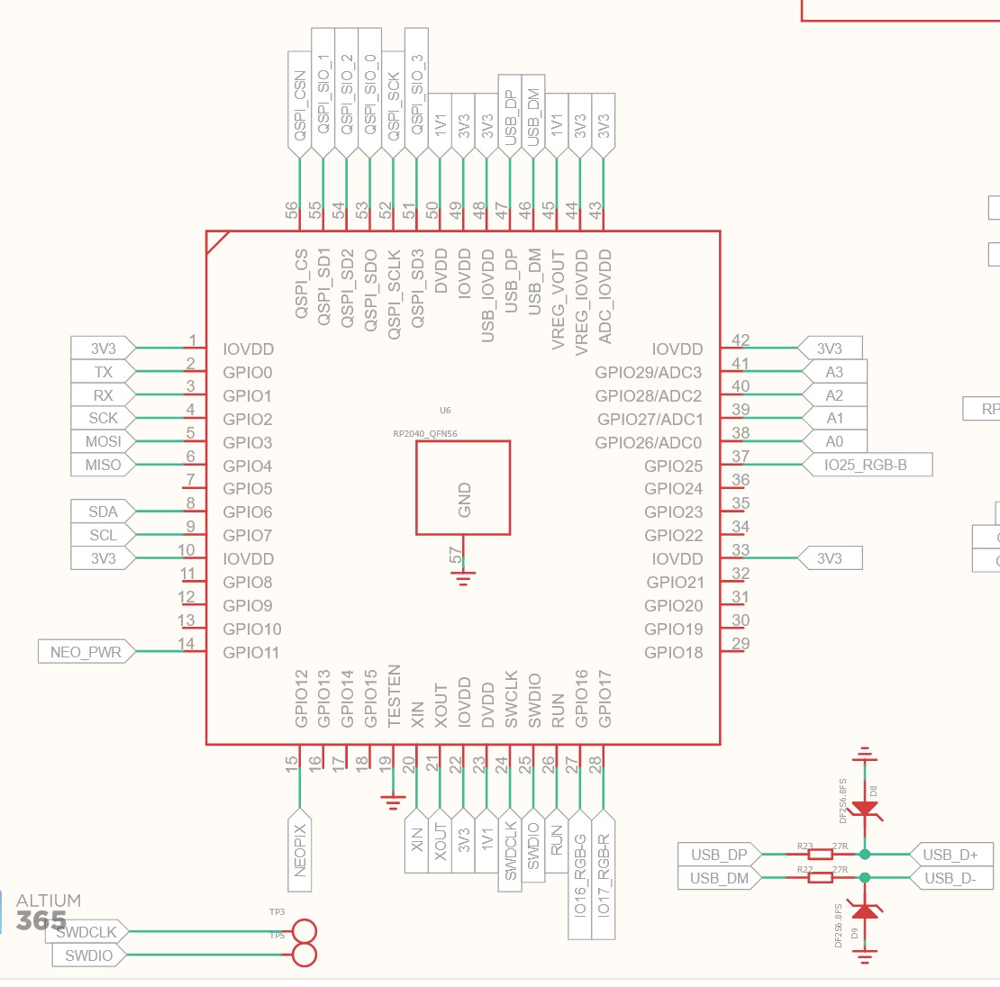
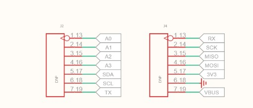
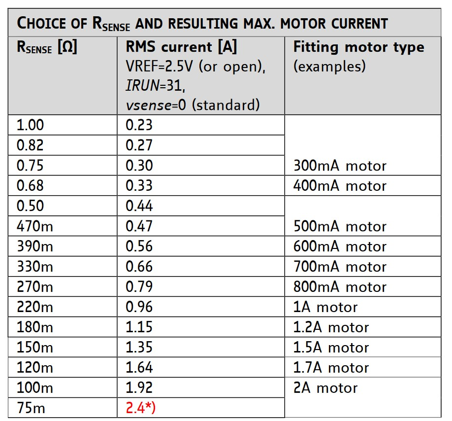

## 2023 01 02

- power delivery / swap options (jumper... ? diodes ?) 
- will want a high-side switch board, then... w/ bleeder, 
- design a proto, discuss the whole scheme with quentin and leo 
  - what's the set for this redesign ?
    - low-fet
    - accelerometer
    - stepper
    - h-bridge
    - ... light sensor ? 
    - loadcell
    - high-fet(s) ... ? 
      - does it switch 5v siggies as well ? 
- centered backpack-hookup vs. off-to-side 
  - centered forbids smd-ing, and introduces trouble 

## 2022 01 03

OK... so I'm out here with the low-fet as a proto, I want to confront the power delivery trouble... I have *maybe* 24v (/ **vcc**) coming from the backpack GPIO, and want to intelligently switch it onto power applications: fet supply, stepper supply, etc... 

Best I can think of ATM is a jumper select... since in some cases we will *not* want auto voltage demotion - i.e. high current draws from 24v suddenly dropping to 5v (usb) supply, borking them. 

Jumpers are either 0R's / solder bridges, or a 1x3 header w/ one of those little jumper cap thingies. 

That sorted, I want some decent 0.1" pitch screw terminals also, non? Then I think I'm actually on to backpack design. 

Yar, OK, and I spent (wasted?) the time to finish the low-fet design. These 30x30 options are pretty tiny. 

So - backpack design. I need a side-mounted header footprint. 

OK I have prototypes for the basics, I guess I'll head in and consult with LQ to collect some opinions on how to best proceed w/ the grunt of it. 

OK, meeting w/ Quentin briefly, then on to footprint unfk-ing and I think just whole hoggen it, right? Want input on stepper modules as well... 

### Q's for Quentin / Leo 

- what style footprint for XIAOs?
  - smt-only, 
  - smt-or-thru
    - solder paste for these ? 
  - these tht pads are 2 small anyways, 
    - and don't show full width of xiao (!) 
- power select ? 
- stepper-module, or h-bridges ? 

### Quentin's Thoughts

- why not do 31mm grid, then we can slap 'em on   
- highly fab-able versions are tight, but probably quentin will design them 
- modular-phy-thing
  - cool, neat 
- xiao solders on 
- power select notion is OK 
- do dummy stepstick thing 
- do also tmc2209, classic case of both 
  - can probably free up enough pins for this badboy, non ? uart looks like one pin 
  - investigate arduino libraries for it... 

### Carrying On 

OK, that's some good input, I think. I'll carry on with the rest of the deesign next... probably at the home lab. 

- we need to hookup via VIN (on the bottom), not `5V` 
  - we can use the SMD version 
  - add a diode, homie, 
    - shottky, tiny... 
- maybe should-do in KiCAD... 

## 2023 01 04

OK, today should be ~ finishing this, ish. 

- consider KiCAD - try to draw just the TTL ?
- then... notes above, and that stepper chip...
  - xiao footprint update
  - ... just running through 'em mostly, right ?
  - hotplate pogo boards 
  - fancy stepper chip requres some fkery for 5v operation, see datasheet pp 13 
  - fancy stepper D21 *can* hot-swap TX pin to become RX pin, methink
  - to double-up UART we'll need to use XIAO RP2040 pin D3(A3) in addition to D6, the standing TX... or find some other pair, per the RP2040 datasheet `table 278: 2.19.2` / pp 236 (!) leaving us with 5 available pins elsewise:
    - STEP
    - DIR
    - MS1
    - MS2
    - DIAG
    - (not needed) SPREAD 
    - (need to investigate) VREF 

...

Done w/ the low-fet, on to a blank thing... I think I want the stepstick next, as we are ~ going in order of importance or something. 

Let's see about these stepstick pinouts then...

| A4988 | MP6500 | DRV8434a | TMC2209 |
| --- | --- | --- | --- |
| no 5v | 5v OK | 5v OK | 5v OK (?) NOT QUITE |
|  |  |  |  [TMC2209 Stick Ref](https://learn.watterott.com/silentstepstick/pinconfig/tmc2209/) |

It's a hot spaghetti mess... but I can (?) maybe make it work... IDK exactly if this has any value, esp. if we are on board for a TMC2209 stick? Probably it will be rad to be able to show as a simple example... in any case it's probably just a half hour or so, so I'll get into it. 

For this reason (no real 5v support) I'm going to jump straight to the TMC2209 bare-chip implementation. 

### TMC2209 

OK I'm ~ partway through this at the moment, then tomorrow I'll be finishing this and the rest... 

| | |
| --- | --- |
| |  |

So I need to pick two of these for the UART interface, according also to the RP2040 datasheet at 2.19.2. I'm going to use the "TX" labelled pin (D6) already for one of these, as the D21 can drive UART TX and RX from that pin. That's GPIO0 on the RP2040, so it's UART0 TX, I want a UART0 RX pin... available on GPIO13: nc, GPIO17: hooked to a xiao led, GPIO29: pin A3. Nice. 

It looks like we ~ want EN, almost for sure: we have only three pins left. I think the bank is that we can leave the MS1/MS2 pins nc, since they are uart-address select pins... and VREF, I probably need to set, but maybe can just go HI, forever? 

W/ VREF, I think we can leave it open, as there's this table:

And we have some configuration registers for "internal vref" - ... this is mentioned in more detail in the ds section 9.1, SO I can leave one last pin free for an OG limit switch, nice nice. 

- solder bridge for stealthchop / spreadcycle, 
- EN: switches on / off and clears DIAG
- DIAG: stall detect interrupt 
- switch: I'd love a normie limit pin here... / debug out 

So: where to map EN, DIAG, and the LIMIT switch... aaaand place the limit, and how to swap 5V and big-v supplies... 

OK, found some more info on the stallguard stuff, which I think only works in stealthchop mode, which is all tune-dependent etc, goddamn... so I'm going to put a jumper in there for it, so that we can pick with a 1k resistor. 

OK this is... arduous, goddamn, last schematic-figuring is the 5v-supply-selection. I think I solved that... just with another GD jumper, sheesh. Unless I can find a dual-throw switch part, this will be the move, let's see... there are some, but none of which are properly rated. The other option would be some logic & FETs, nobody has time for that, moving on. 

I think I'm actually headed into routing town then? 

That's done now...

### H-Bridge Stepper

I kind of want one of these for insurance, and I think it's maybe quick? Let's see... 

That's done, and I guess I won't do ahn single-hbridge version? Or I will do since it's a simple teardown... 

### High Fet

... done 

### Breadboard Thing 

... last thing, I think (?), then silks and ordering setup... 

yar this is done

### Pogo Generalist 

... 8-pin setups ? ttl-thru and usb-c thru ? idk usb-c standalone at least, so we can "multiplex" 'em out - i.e. stick a few USB-C ports on one tool... 

## 2022 01 06 

OK I'm doing silks and sending out orders on this today, it's time to work on other stuff... we have motors in this new form factor, and breadboard-style which we can use to make up just about anything else. Truth be told we don't know exactly what the relevant bits are yet, and anyways designing new things is pretty quick, so it can be left off. I'll spin out drawings and schematics... 

- backpack (done)
- breadboard (done)
- high fet (done)
- low fet (done)
- stepper h-bridge (done)
- stepper tmc2209 (done)
- pogo usb thru (done) 

Then I should push the order and put notes somewhere... including scratch on where RP2040 pins are, i.e. which are they really, likewise D21, ? And reorg the /D21 and /XIAO and /BackPacks 

Yar, OK, orders are out so it's just the docs now, which *will* be useful when we do the firmware (!) 

---

## Bus Power Delivery

5V logic is easily "swapped" w/ the XIAO internal diodes, so we can supply 5v via USB and via the bus simultaneously w/o trouble.

24v swapping is more arduous, I think... I'm reluctant to put any substantial circuitry onboard... mosfets, etc, so I'm just dropping in a manual-select 1x3 header w/ jumper-thingy here. 

## Stepper Modules

We have the tried & true h-bridges designs, but also i.e. these:

- https://www.pololu.com/product/1182/pictures 
- https://www.pololu.com/product/2968/pictures 

And a flurry of others, which can be made to fit on these footprints. These can be had on amazon for ~ `$5` a piece, so if the carrier board is `0$` (effectively is), we have ~ $10 modular stepper solutions: not bad. Also it's less idiosyncratic. 

Pinouts get a wee bit messy, esp. if we want also to SPI or UART to some of the fancy devices. I think a skookum, simple solution will be well loved for some interval. 

## Stack Heights

A standard header has 2.5mm of insulation, but our straddling connectors are ~ 3.1mm on this dimension. I can find headers with up to 2.7mm insulation height, but no more - so I think we will be stuck doing this w/ a mechanical intervention between layers. 

## Cycle Tasks 

- new modular-things w/ backpack options & xiaos
  - low-fet (heaters)
  - high-fet backpack power delivery 
  - stepper (via modules?)
  - h-bridge 4 wavegen, etc 
  - ... that's actually probably all we want
- ttl-backpack
- rs485-backpack (maybe)
- some mechanical defaults, right ? 
  - though more-than-likely the bus doesn't get wide use until some development happens, so can do the mechanical dev later 
  - but the stepper should have a baseplate, right ? 
- pogo-thru-bangers for tool-swappen... 
  - do these in modular strip designs ? 
  - ttl 8-pin ?
    - w/ high-side switch 
  - usb-c 8-pin ?

## Cycle Orders

- ... done 