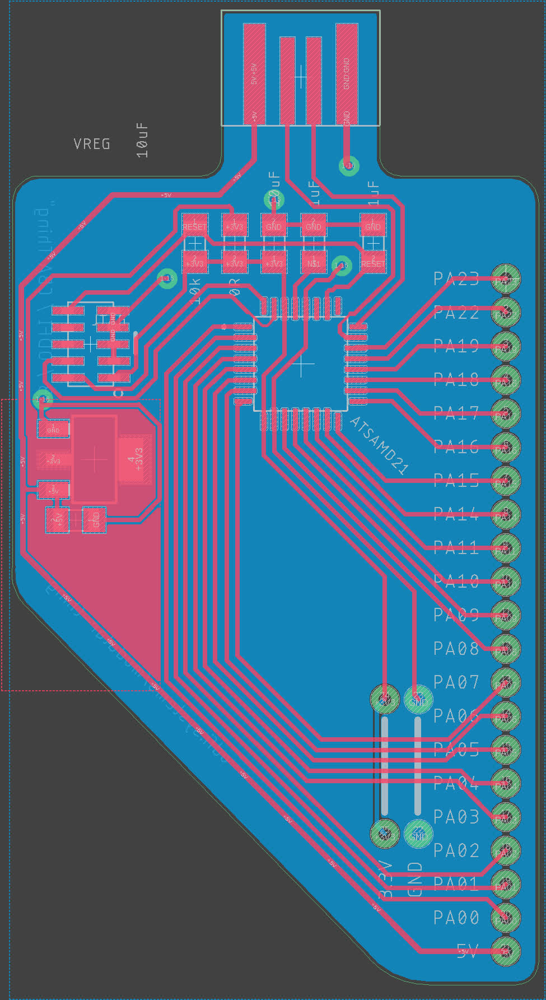
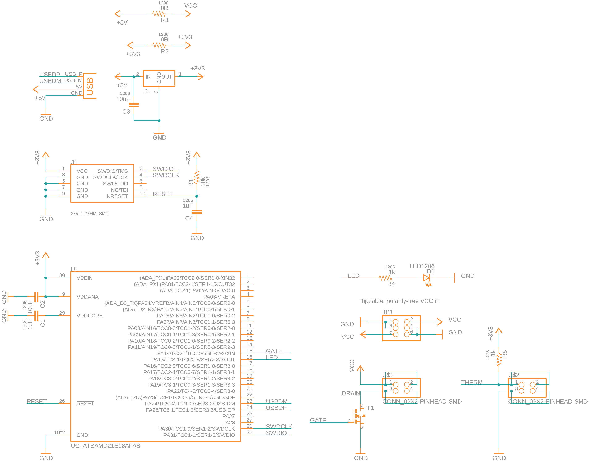

## atsamd21 based modular-things circuits

---

| accelerometer | |
| --- | --- |
|  |  |

| part | count | info ? |
| --- | --- | --- |
| ATSAMD21 | 1 | uc |
| JTAG 10-pin | 1 |
| VREG | 1 | 
| LSM6DSO Accelerometer | 1 |
| 0R 1206 | 1 |
| 1k 1206 | 1 |
| 2k2 1206 | 2 |
| 10k 1206 | 1 |
| 0.1uF 1206 | 2 |
| 1uF 1206 | 2 |
| 10uF 1206 | 2 |

---

| breadboard | |
| --- | --- |
|  |  |

| part | count | info ? |
| --- | --- | --- |
| ATSAMD21 | 1 | uc |
| JTAG 10-pin | 1 |
| VREG (big) | 1 | 
| 0R 1206 | 1 |
| 10k 1206 | 1 |
| 1uF 1206 | 2 |
| 10uF 1206 | 2 |

---

| capacitive | |
| --- | --- |
|  |  |

| part | count | info ? |
| --- | --- | --- |
| ATSAMD21 | 1 | uc |
| JTAG 10-pin | 1 |
| VREG | 1 | 
| 0R 1206 | 1 |
| 1k 1206 | 3 |
| 10k 1206 | 1 |
| 1uF 1206 | 2 |
| 10uF 1206 | 2 |

---

| low-fet | |
| --- | --- |
|  |  |

| part | count | info ? |
| --- | --- | --- |
| ATSAMD21 | 1 | uc |
| JTAG 10-pin | 1 |
| VREG | 1 | 
| NMOS | 1 |
| 2x3 SMT Header | 1 |
| 2x4 SMT Header | 1 |
| 0R 1206 | 2 |
| 1k 1206 | 2 |
| 10k 1206 | 1 |
| 1uF 1206 | 2 |
| 10uF 1206 | 2 |

---

| oled | |
| --- | --- |
|  |  |

`note: an early version of these circuits need SCL and SDA to be flipped in between the board and the OLED module`

| part | count | info ? |
| --- | --- | --- |
| ATSAMD21 | 1 | uc |
| JTAG 10-pin | 1 |
| VREG | 1 | 
| OLED Module | 1 |
| 0R 1206 | 1 |
| 4.99k 1206 | 2 |
| 10k 1206 | 1 |
| 1uF 1206 | 2 |
| 10uF 1206 | 2 |

---

| potentiometer | |
| --- | --- |
|  |  |

| part | count | info ? |
| --- | --- | --- |
| ATSAMD21 | 1 | uc |
| JTAG 10-pin | 1 |
| VREG | 1 | 
| POTS | 2 |
| 0R 1206 | 1 |
| 10k 1206 | 1 |
| 1uF 1206 | 2 |
| 10uF 1206 | 2 |

---

| rgbb | |
| --- | --- |
|  |  |

| part | count | info ? |
| --- | --- | --- |
| ATSAMD21 | 1 | uc |
| JTAG 10-pin | 1 |
| VREG | 1 | 
| RGB LED | 1 |
| SWTCH | 1 |
| 1x3 SMT Header | 1 |
| 0R 1206 | 1 |
| 1k 1206 | 3 |
| 10k 1206 | 2 |
| 1uF 1206 | 2 |
| 10uF 1206 | 2 |

---

| servo | |
| --- | --- |
|  |  |

| part | count | info ? |
| --- | --- | --- |
| ATSAMD21 | 1 | uc |
| JTAG 10-pin | 1 |
| VREG | 1 | 
| 1x3 SMT Header | 1 |
| 0R 1206 | 1 |
| 10k 1206 | 1 |
| 1uF 1206 | 1 |
| 10uF 1206 | 3 |

---

| stepper-hbridge | |
| --- | --- |
|  |  |

| part | count | info ? |
| --- | --- | --- |
| ATSAMD21 | 1 | uc |
| JTAG 10-pin | 1 |
| VREG | 1 | 
| H-Bridge | 2 |
| 2x3 SMT Header | 1 |
| 0R 1206 | 2 |
| 120R | 2 |
| Shunt | 2 | use ~ 300mOhm, we think |
| 10k 1206 | 1 |
| 0.1uF 1206 | 2 |
| 1uF 1206 | 4 |
| 10uF 1206 | 4 |

---

| sneaky mechaduino clone | |
| --- | --- |
|  |  |

In the style of the xiao boards (hole spacing / sizewise / PHY breakout wise) but w/ xiao! 

| part | count | info ? |
| --- | --- | --- |
| ATSAMD21 | 1 | uc |
| JTAG 10-pin | 1 |
| VREG | 1 | 
| H-Bridge | 2 |
| Shunt | 2 | use ~ 300mOhm, we think |
| 120R | 2 |
| 5k1 1206 | 2 |
| 10k 1206 | 1 |
| 0.1uF 1206 | 3 |
| 1uF 1206 | 4 |
| 10uF 1206 | 4 |

---

| time-of-flight | |
| --- | --- |
|  |  |

| part | count | info ? |
| --- | --- | --- |
| ATSAMD21 | 1 | uc |
| JTAG 10-pin | 1 |
| VREG | 1 | 
| VL53 TOF | 1 |
| 0R 1206 | 1 |
| 4.99k 1206 | 2 |
| 10k 1206 | 1 |
| 0.1uF 1206 | 1 |
| 1uF 1206 | 2 |
| 10uF 1206 | 2 |

---