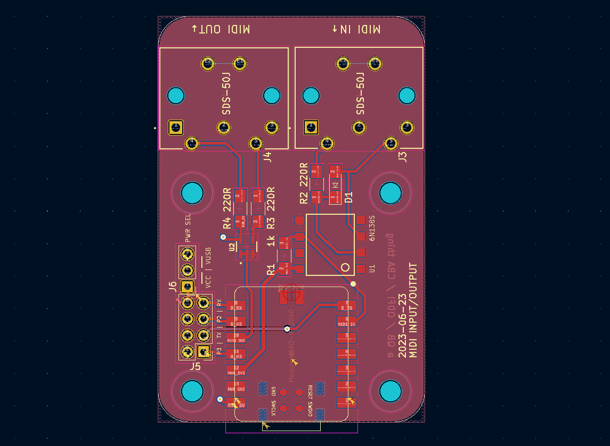
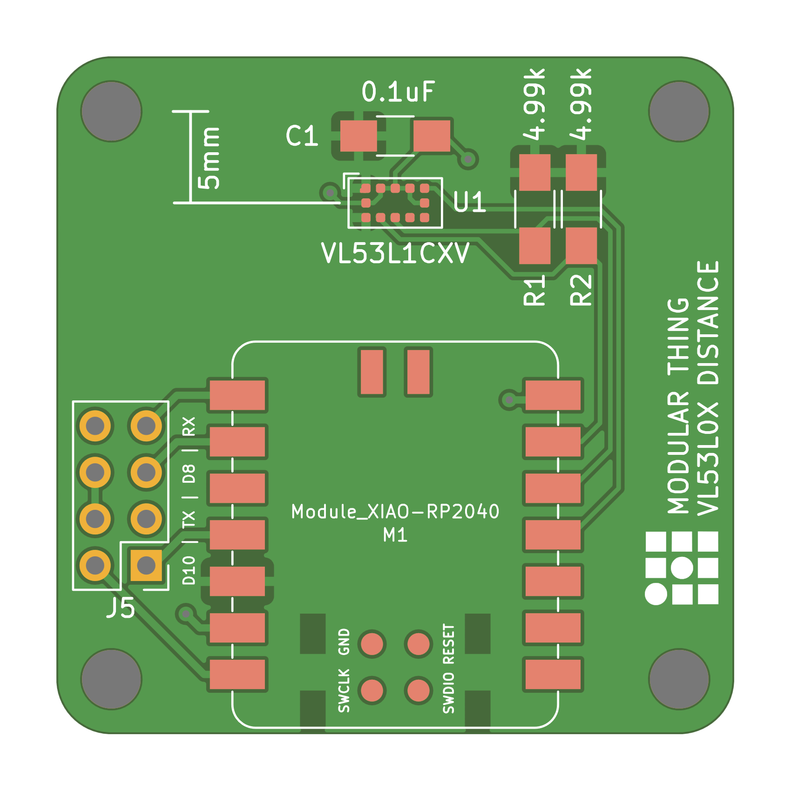
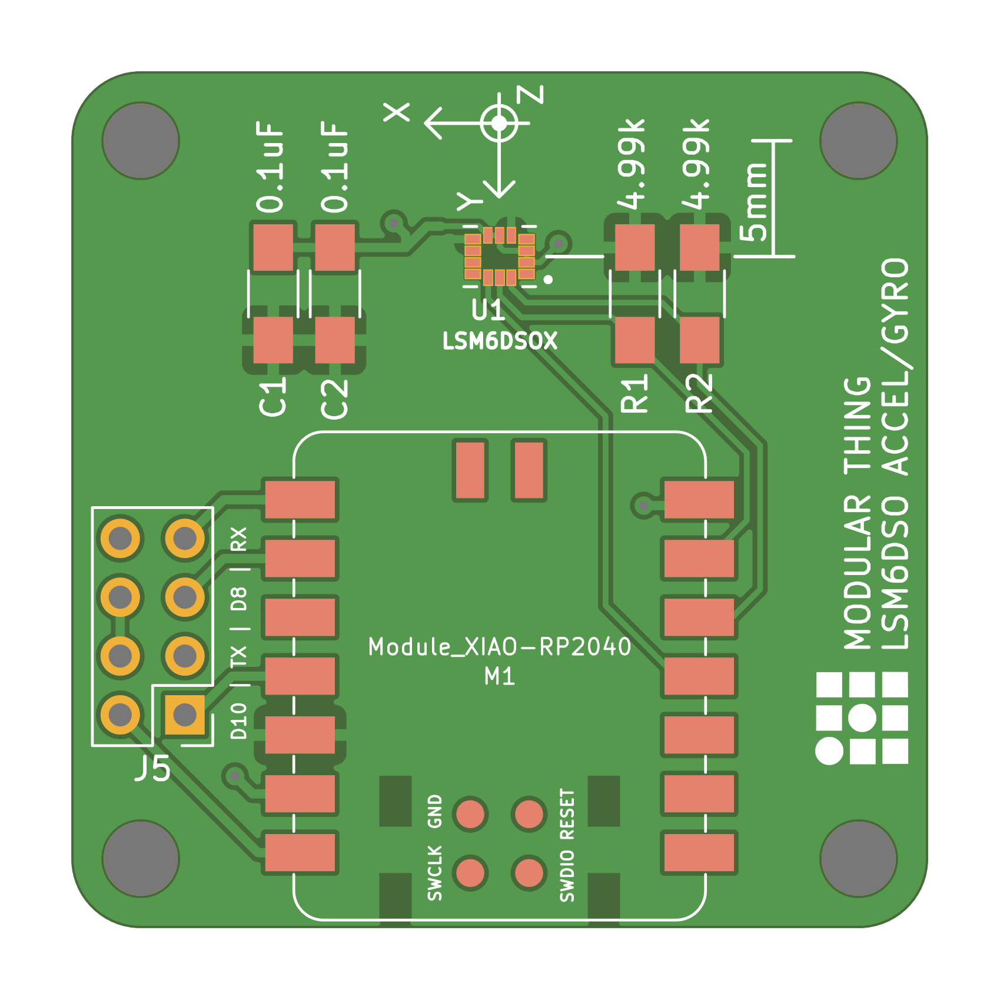
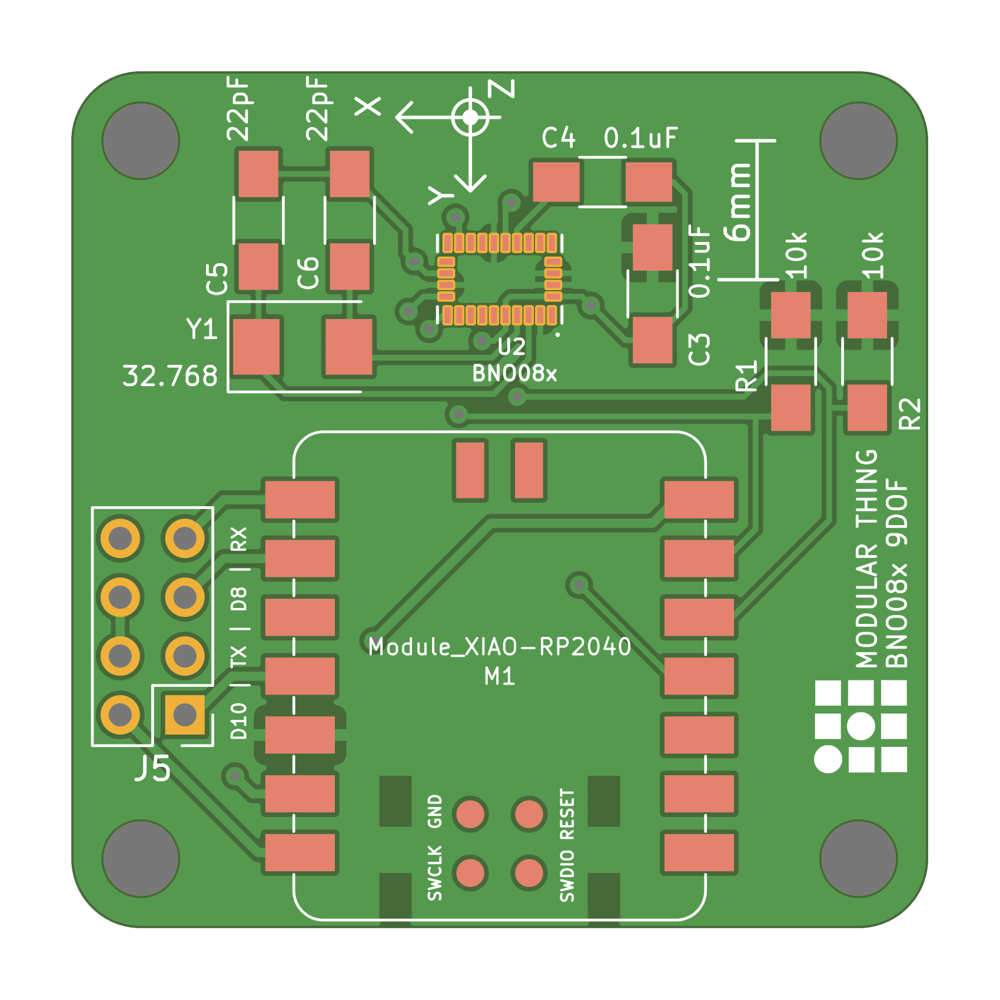
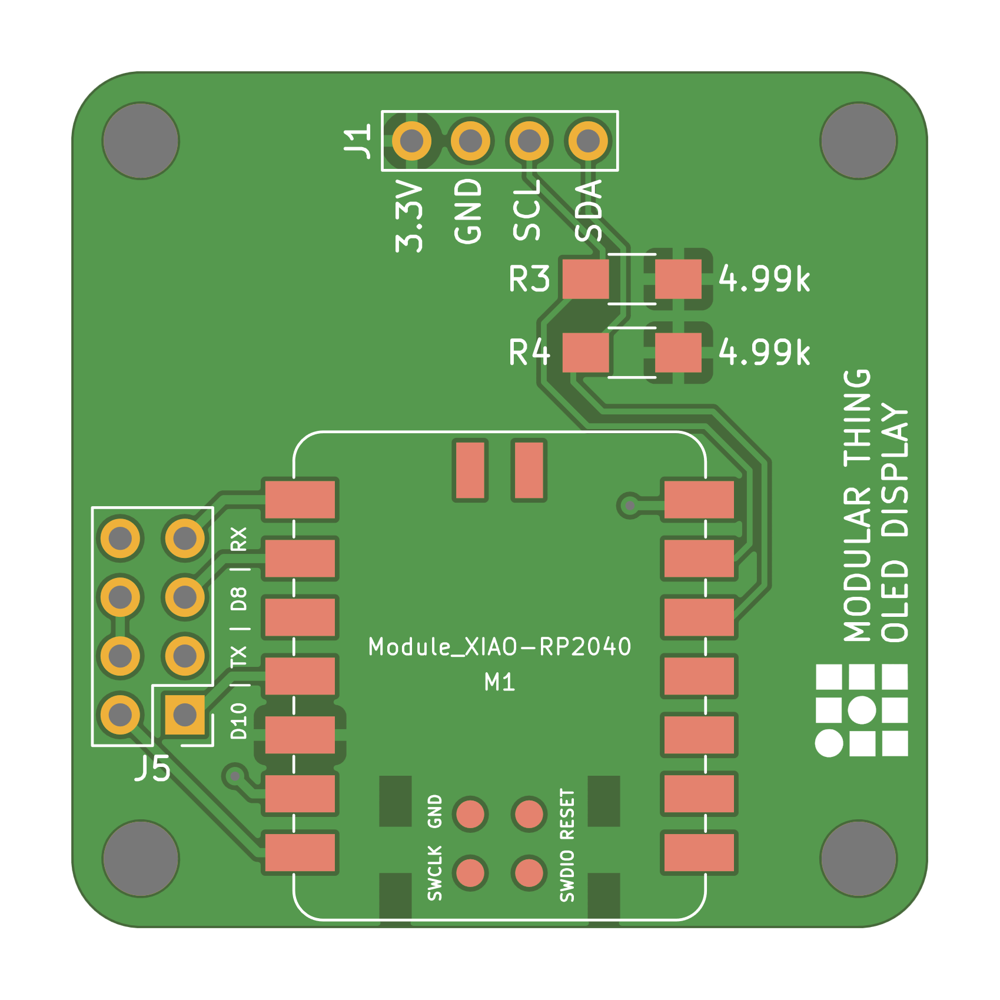
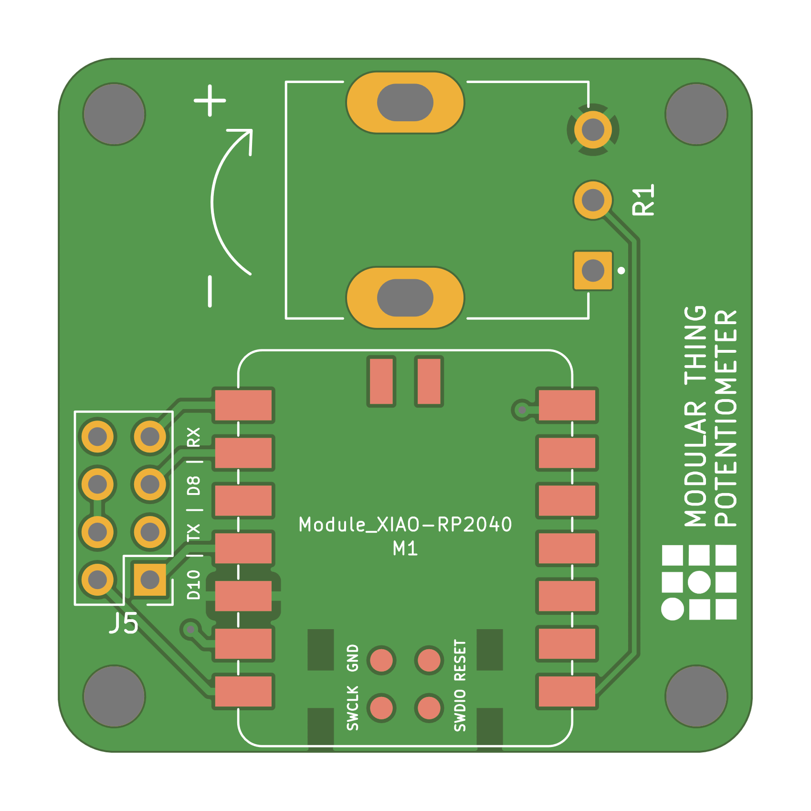
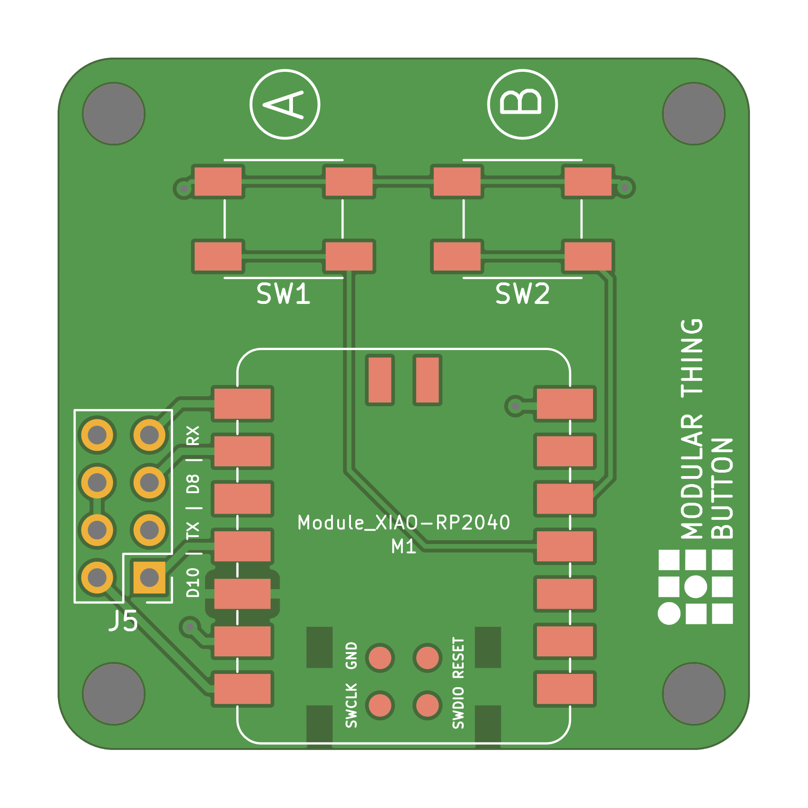

## xiao based modular-things circuits

| base | |
| --- | --- |
|  |  |

| breadboard | |
| --- | --- |
|  |  |

| high-fet | |
| --- | --- |
|  |  |

| low-fet | |
| --- | --- |
|  |  |

| MIDI-io | |
| --- | --- |
|  |  |

---

| stepper-hbridge | |
| --- | --- |
|  |  |

| part | count | info ? |
| --- | --- | --- |
| XIAO | 1 | uc |
| H-Bridge A4950 | 2 |
| 0.1uF 1206 | 2 |
| 1uF 1206 | 2 |
| 10uF 1206 | 2 |
| 120R 1206 | 2 |
| 0R300 1W 1206 | 2 |

---

| stepper-tmc2209 | |
| --- | --- |
|  |  |

---

| distance-VL53L1 | |
| --- | --- |
|  |  |

| accel-LSM6DSO | |
| --- | --- |
|  |  |

| accel-BNO08x | |
| --- | --- |
|  |  |

| display-OLED | |
| --- | --- |
|  |  |

| potentiometer-P120 | |
| --- | --- |
|  |  |

| button | |
| --- | --- |
|  |  |
